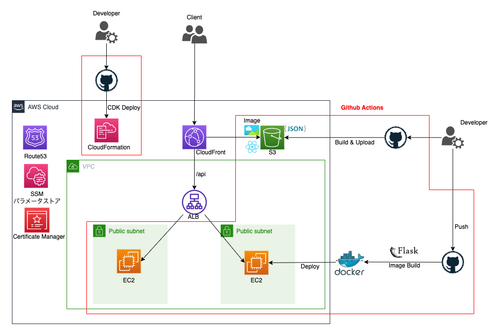
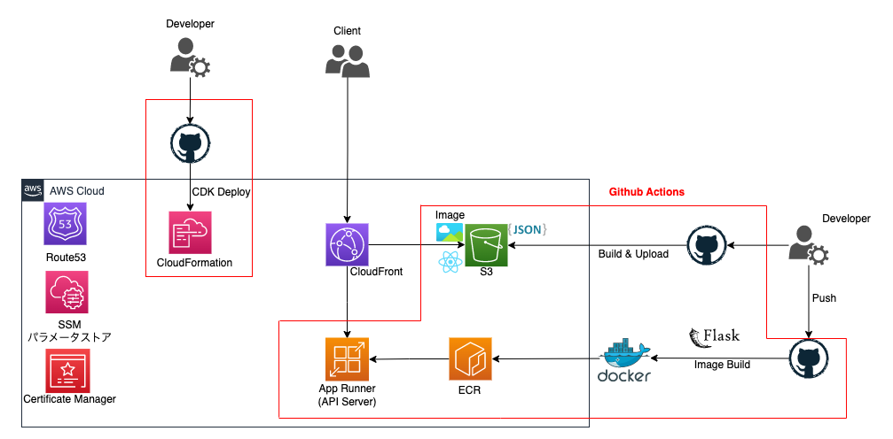
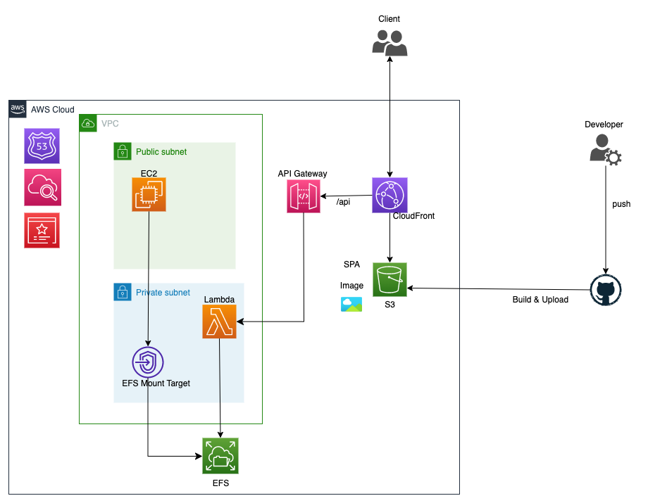

# DALL-E-3 による画像生成アプリ

## 概要

[DALL-E-3](https://help.openai.com/en/articles/8555480-dall-e-3-api)の API を利用した画像生成 AI とお題の画像の類似度を比較して算出するアプリ

- 参考資料<br>
  [Open AI](https://platform.openai.com/docs/api-reference)

## インフラ構成図

**現在**

<br>

**改善 ver**

- コンテナとして App Runner を使用



<br>

**サーバーレスアーキテクチャ ver**

- EFS MountTarget を使用してマウントする


<br>

## 環境構築

1. Open AI アカウント作成
2. [Open AI の API キーを発行する](https://nicecamera.kidsplates.jp/help/feature/ai-kata/openapi_apikey/)
3. git clone する
4. .env を作成し API キーの値を記述

```
OPENAI_API_KEY="your api key"
```

5. streamlit を起動

```
streamlit run main.py
```

## 技術スタック


